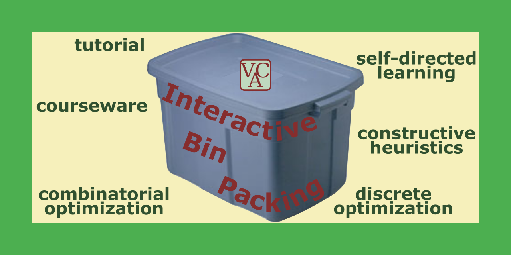

# Interactive Bin Packing

[](#interactive-bin-packing)

Copyright (C) 2008, 2010, 2020-2022 [Vincent A. Cicirello](https://www.cicirello.org/).

| | |
| :--- | :--- |
| __Packages and Releases__ | [](https://search.maven.org/artifact/org.cicirello/interactive-bin-packing) [](https://github.com/cicirello/InteractiveBinPacking/releases) |
| __Build Status__ | [](https://github.com/cicirello/InteractiveBinPacking/actions/workflows/build.yml) [](https://github.com/cicirello/InteractiveBinPacking/actions/workflows/codeql-analysis.yml) |
| __JaCoCo Test Coverage__ | [](https://github.com/cicirello/InteractiveBinPacking/actions/workflows/build.yml) [](https://github.com/cicirello/InteractiveBinPacking/actions/workflows/build.yml) |
| __Security__ | [](https://snyk.io/vuln/maven%3Aorg.cicirello%3Ainteractive-bin-packing) [](https://snyk.io/test/github/cicirello/InteractiveBinPacking) |
| __License__ | [](https://github.com/cicirello/InteractiveBinPacking/blob/master/LICENSE) |

## Overview

Interactive Bin Packing provides a self-guided 
tutorial on combinatorial optimization, the bin packing problem, 
and constructive heuristics for bin packing. It also enables the 
user to interact with bin packing instances to explore their own 
problem solving strategies, or to test their knowledge of the 
various constructive heuristics covered by the tutorial. The 
application is not a solver for bin packing. Interactive 
Bin Packing is a tool for learning about the bin 
packing problem, as well as for learning about heuristic 
techniques for solving instances of the problem. 

The objectives of Interactive Bin Packing include:

* gaining an understanding of the bin packing problem, 
  and more generally how the bin packing problem is an 
  example of a combinatorial optimization problem;
* learning about constructive heuristics;
* learning about the most common constructive heuristics 
  for the bin packing problem, including first-fit, best-fit, 
  first-fit decreasing, and best-fit decreasing; and
* serving as an interactive environment for students (whether 
  in the formal context of a class, or just for informal 
  self-guided learning) to explore potential problem solving 
  methods for combinatorial optimization.

In addition to the Interactive Bin Packing application source code,
this repository also contains example assignments.  Specifically,
the [assignments](assignments) directory
contains example assignments that can either be used by
self-guided learners, or which can be adapted and used by
instructors in courses, such as within courses on discrete 
mathematics, algorithms, or artificial intelligence.

First time users should start by taking a look at the
sections below on [User Documentation](#user-documentation)
as well as [Installing and Running the 
Application](#installing-and-running-the-application). 
We also recommend that first time users (whether students in courses
or self-learners) work through the 
[first of the example assignments](assignments/1).


## Java 11+

The prebuilt jar of the application is built with the OpenJDK 11.

## Example Assignments

In addition to the Interactive Bin Packing application, the
repository contains a directory of [Example Assignments](assignments)
that utilize the application. Self-directed learners may begin with
[assignments/1](assignments/1); while course instructors may prefer
to assign their students [assignments/2](assignments/2), which utilizes
the Session Log functionality introduced in [version 3.1.0](CHANGELOG.md) 
to make it easy for instructors to validate students' work. 

## User Documentation

All user documentation is contained within the application itself, 
which you can access via two
commands in the Info menu:

* The Tutorial command in the Info menu opens a self-guided tutorial 
  on combinatorial optimization, the bin packing problem, and 
  constructive heuristics for bin packing. It will also walk you through 
  using the application, and all of its functionality. 
* The Help command (also in the Info menu) provides documentation of all 
  menu functions and other user interface elements.
* We recommend that instructors take a look at the documentation of the
  commands of the Session menu (see the Help command), which enables having
  students save session logs, and also provides functionality for validating
  the session logs they submit to you to confirm successful completion of
  assignments that utilize the application.

The first time that you use the application, we recommend that you 
begin by choosing the Tutorial command from the Info menu, and working 
your way through the self-guided tutorial.  


## Installing and Running the Application

### Installing == Downloading

The Interactive Bin Packing application is available as a prebuilt, executable
jar file from a variety of sources. The filename of the jar is of the form
`interactive-bin-packing-X.Y.Z.jar`, where X.Y.Z is the version number.

To install, simply download the `jar` of the latest release by doing any of the
following:
* From the command line via 
  [Maven Central](https://search.maven.org/artifact/org.cicirello/interactive-bin-packing):  
  ```Shell
  curl -O -J -L  "https://repository.sonatype.org/service/local/artifact/maven/content?r=central-proxy&g=org.cicirello&a=interactive-bin-packing&e=jar&v=LATEST"
  ```
* From 
  [Maven Central](https://search.maven.org/artifact/org.cicirello/interactive-bin-packing) 
  repository website: Select most recent release, select jar from the Downloads link.
* From the 
  [GitHub Package Registry](https://github.com/users/cicirello/packages?repo_name=InteractiveBinPacking): 
  Select the most recent release, and download the jar of the application. 
* From [GitHub releases](https://github.com/cicirello/InteractiveBinPacking/releases): 
  Simply download the jar from the most recent release.
* Building from the source: See the section on this below.

### Running

The jar file that you downloaded above is an executable jar. To run, assuming 
that you have a Java runtime environment (JRE version 11 or higher)
installed on your system, then do any of the following:
* Simply double click the jar file.
* From the command line (assuming your current directory is that of the 
  jar file), you can run with: `interactive-bin-packing-X.Y.Z.jar`.
  Just replace the X.Y.Z with the version number that you downloaded.
* Or from the command line, you can similarly run 
  with: `java -jar interactive-bin-packing-X.Y.Z.jar`. 

## Building and Testing the Application (with Maven)

The Interactive Bin Packing Application is built using Maven, which you
can download and install from the 
official [Apache Maven website](https://maven.apache.org/). 

The root of the repository contains a Maven `pom.xml`.  To build the library, 
execute `mvn package` at the root of the repository, which
will compile all classes, run all tests, and generate jar files of the 
application, the sources, and the javadocs.  The file names
make this distinction explicit.  All build artifacts will then
be found in the directory `target`.

To include generation of a code coverage report during the build,
execute `mvn package -Pcoverage` at the root of the repository to 
enable a Maven profile that executes JaCoCo during the test phase.

The jar file of the application is executable, so you then simply
double click it to run.


## License

The Interactive Bin Packing Application is licensed under 
the [GNU General Public License 3.0](https://www.gnu.org/licenses/gpl-3.0.en.html).

## Contribute

Report bugs, suggestions, feature requests, etc via 
the [issues tracker](https://github.com/cicirello/InteractiveBinPacking/issues).
If you would like to contribute to Interactive Bin Packing in any way, such 
as reporting bugs, suggesting new functionality, or code contributions 
such as bug fixes or implementations of new functionality, then start 
by reading 
the [contribution guidelines](https://github.com/cicirello/.github/blob/main/CONTRIBUTING.md).
This project has adopted 
the [Contributor Covenant Code of Conduct](https://github.com/cicirello/.github/blob/main/CODE_OF_CONDUCT.md).

## Support and Discussion

To obtain support from the maintainers or from other community members, or to discuss ideas 
for potential new functionality, we are 
using [GitHub Discussions](https://github.com/cicirello/InteractiveBinPacking/discussions). For
support, start a new discussion with the `Q&A` category. If you would like to discuss ideas for
new functionality before submitting an issue, you can start a discussion with the `Ideas` category.
You can use the `General` category for any other community discussions.


